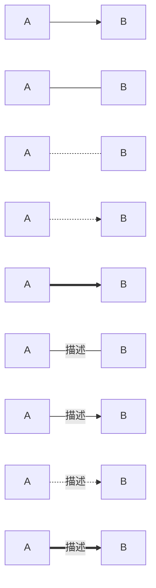
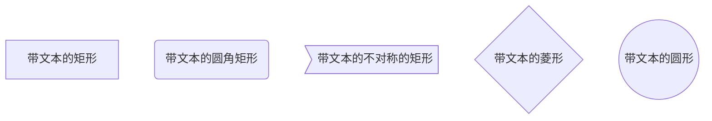
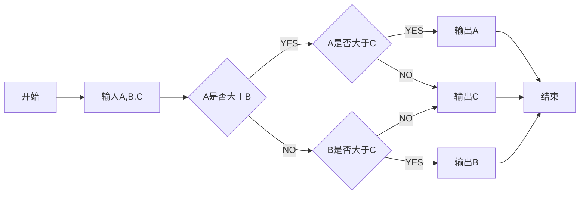
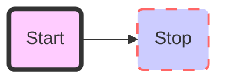
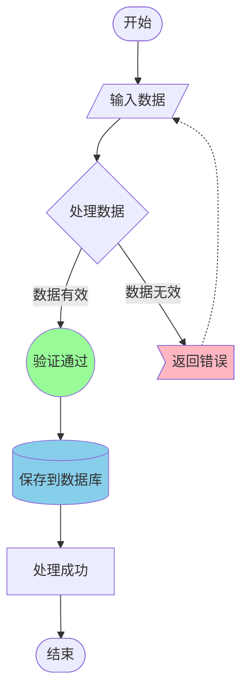
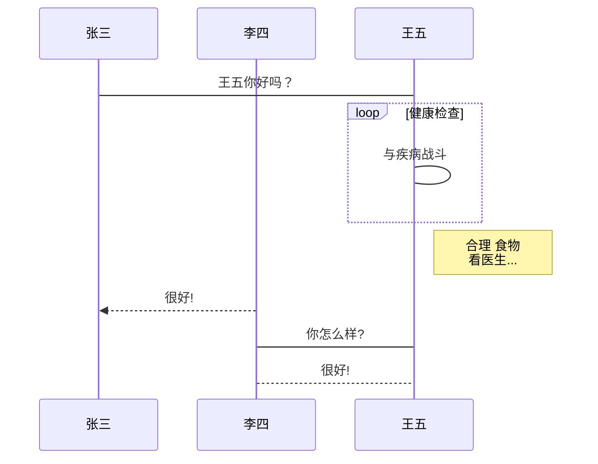
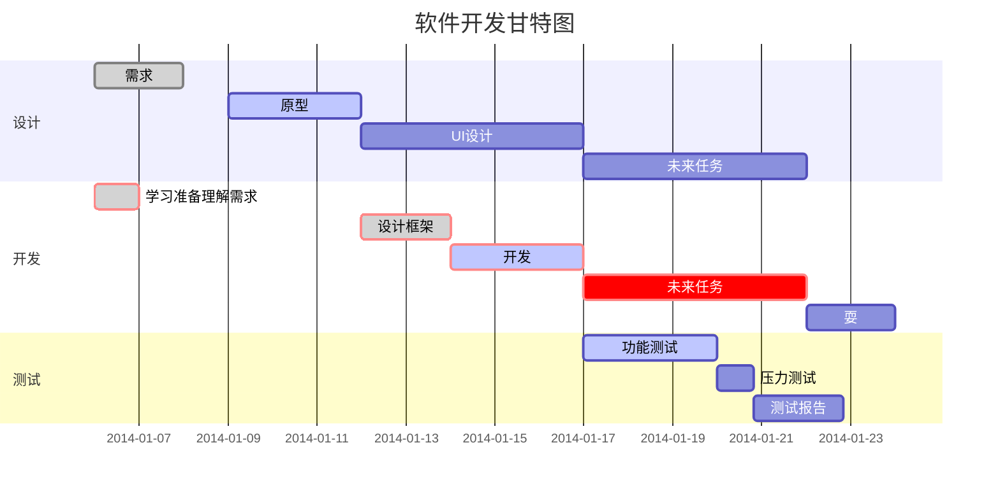

<div style="text-align:center;font-weight:bold;font-size:2em"> 学习如何使用Markdown </div>

<div style="text-align:center;">2024-11-25</div>

<!-- TOC -->
- [引言](#引言)
- [1 标题](#1-标题)
  - [1.1 二级标题](#11-二级标题)
    - [1.1.1 三级标题](#111-三级标题)
- [2 段落](#2-段落)
  - [2.1 换行](#21-换行)
  - [2.2 分割线](#22-分割线)
- [3 文字](#3-文字)
  - [3.1 字体](#31-字体)
  - [3.2 小标](#32-小标)
- [4 列表](#4-列表)
  - [4.1 无序列表](#41-无序列表)
  - [4.2 有序列表](#42-有序列表)
- [5 块](#5-块)
- [6 代码](#6-代码)
- [6.1 单行代码](#61-单行代码)
- [6.2 代码块](#62-代码块)
- [7 链接](#7-链接)
- [8 脚注](#8-脚注)
- [9 图片](#9-图片)
- [10 表格](#10-表格)
- [11 图](#11-图)
- [12 表情符号](#12-表情符号)
- [13 公式](#13-公式)
- [14 内嵌HTML](#14-内嵌html)
- [总结](#总结)
<!-- /TOC -->

# 引言<a name="引言"></a>

Markdown是一种轻量级标记语言，以其简洁的语法和强大的功能，已经成为当今技术写作、文档编撰的首选工具。不论是撰写技术文档、编写博客文章，还是进行日常笔记整理，Markdown都能让我们专注于内容创作，而不必过多关注排版细节。本文将系统地介绍Markdown的用法，帮助读者快速掌握这一实用工具，提高写作效率。通过学习本文内容，您将能够使用Markdown创建结构清晰、格式优美的文档。

# 1 标题<a name="1-标题"></a>

markdown里的标题语法如下，其中此处标题为一级标题：

`#(一级标题)##(二级标题)###(三级标题)`

效果参照本文。

## 1.1 二级标题<a name="11-二级标题"></a>

这是二级标题的效果。

### 1.1.1 三级标题<a name="111-三级标题"></a>

这是三级标题的效果。

# 2 段落<a name="2-段落"></a>

## 2.1 换行<a name="21-换行"></a>

两行直接空一行

第一行

第二行

如果不空一行会出现这样的情况

第一行
第二行

## 2.2 分割线<a name="22-分割线"></a>

单独一行使用---或***

如下所示：

这是---

---

这是***

***

# 3 文字<a name="3-文字"></a>

## 3.1 字体<a name="31-字体"></a>

**粗体**：`**粗体**`

~~删除线~~: `~~删除线~~`

<u>下划线</u>: `<u>下划线</u>`

*斜体*: `*斜体*`

==高亮==: `==高亮==`

为了显示\*，可以使用转义符号`\`：`\*`

## 3.2 小标<a name="32-小标"></a>

上标: a<sup>2</sup>: `a<sup>2</sup>`

下标: a<sub>2</sub>: `a<sub>2</sub>`

# 4 列表<a name="4-列表"></a>

## 4.1 无序列表<a name="41-无序列表"></a>

用法：`(*/+/-) + 空格 + 列表内容`

列表如下所示：

* 一级
* + 二级
* 一级
* + 二级
* + - 三级

代码：

```
* 一级
* + 二级
* 一级
* + 二级
* + - 三级
```

## 4.2 有序列表<a name="42-无序列表"></a>

用法：`数字 + (.) + 空格`

如下：

1. 一
2. 二
3. 三

代码：
```
1. 一
2. 二
3. 三
```

# 5 块<a name="5-块"></a>

用法：

> `> + 回车`
> 
> 这是块的第二行

# 6 代码<a name="6-代码"></a>

# 6.1 单行代码<a name="61-单行代码"></a>

用法如下:

```
`int a = 1;`
```

效果： `int a = 1;`

# 6.2 代码块<a name="62-代码块"></a>

用法如下:

> \`\`\` + 语言类型 + 回车
``` c 
#include<stdio.h>
int main(){
	printf("hello world\n");
	return 0;
}
```

代码如下：

```
    ``` c 
    #include<stdio.h>
    int main(){
        printf("hello world\n");
        return 0;
    }
    ```
```

# 7 链接<a name="7-链接"></a>

https://3542q.github.io/

[我的博客](https://3542q.github.io/)

[我的博客](https://3542q.github.io/) : https://3542q.github.io/
```
https://3542q.github.io/
[我的博客](https://3542q.github.io/)
[我的博客](https://3542q.github.io/) : https://3542q.github.io/
```

# 8 脚注<a name="8-脚注"></a>

这里有个脚注[^1],

[^1]: hello

```
这里有个脚注[^1],

[^1]: hello
```

# 9 图片<a name="9-图片"></a>

图片可以来自于本地，也可以来自于网络

插入图片


```
插入图片


```

# 10 表格<a name="10-表格"></a>

|	1	|	顶部1	|	3	|
|  :--- |  :--- |  :--- |
|	4	|	内容1	|	6	|
|	7	|	内容2	|	9	|
|	10	|	11	|	12	|

```
|	1	|	顶部1	|	3	|
|  :--- |  :--- |  :--- |
|	4	|	内容1	|	6	|
|	7	|	内容2	|	9	|
|	10	|	11	|	12	|
```

# 11 图<a name="11-图"></a>




```
    ```mermaid
    graph LR
        A[A] --> B[B] 
        A1[A] --- B1[B] 
        A4[A] -.- B4[B] 
        A5[A] -.-> B5[B] 
        A7[A] ==> B7[B] 
        A2[A] -- 描述 --- B2[B] 
        A3[A] -- 描述 --> B3[B] 
        A6[A] -. 描述 .-> B6[B] 
        A8[A] == 描述 ==> B8[B]
    ```
```



```
    ```mermaid
    graph TD
        id[带文本的矩形]
        id4(带文本的圆角矩形)
        id3>带文本的不对称的矩形]
        id1{带文本的菱形}
        id2((带文本的圆形))
    ```
```




```
    ```mermaid
    graph LR
        start[开始] --> input[输入A,B,C]
        input --> conditionA{A是否大于B}
        conditionA -- YES --> conditionC{A是否大于C}
        conditionA -- NO --> conditionB{B是否大于C}
        conditionC -- YES --> printA[输出A]
        conditionC -- NO --> printC[输出C]
        conditionB -- YES --> printB[输出B]
        conditionB -- NO --> printC[输出C]
        printA --> stop[结束]
        printC --> stop
        printB --> stop
    ```
```

自定义样式


```
    ```mermaid
    graph LR
        id1(Start)-->id2(Stop)
        style id1 fill:#f9f,stroke:#333,stroke-width:4px,fill-opacity:0.5
        style id2 fill:#ccf,stroke:#f66,stroke-width:2px,stroke-dasharray: 10,5
    ```
```

流程图：


```
    ```mermaid
    flowchart TD
        Start([开始]) --> Input[/输入数据/]
        Input --> Process{处理数据}
        Process -->|数据有效| Valid((验证通过))
        Process -->|数据无效| Invalid>返回错误]
        Valid --> DB[(保存到数据库)]
        DB --> Success[处理成功]
        Invalid -.-> Input
        Success --> End([结束])
        
        style Valid fill:#98FB98
        style Invalid fill:#FFB6C1
        style DB fill:#87CEEB
    ```
```

时序图：



```
    ```mermaid
    %% 时序图例子,-> 直线，-->虚线，->>实线箭头
    sequenceDiagram
        participant 张三
        participant 李四
        张三->王五: 王五你好吗？
        loop 健康检查
            王五->王五: 与疾病战斗
        end
        Note right of 王五: 合理 食物 <br/>看医生...
        李四-->>张三: 很好!
        王五->李四: 你怎么样?
        李四-->王五: 很好!
    ```
```

甘特图



```
    ```mermaid
    %% 语法示例
            gantt
            dateFormat  YYYY-MM-DD
            title 软件开发甘特图
            section 设计
            需求                      :done,    des1, 2014-01-06,2014-01-08
            原型                      :active,  des2, 2014-01-09, 3d
            UI设计                     :         des3, after des2, 5d
        未来任务                     :         des4, after des3, 5d
            section 开发
            学习准备理解需求                      :crit, done, 2014-01-06,24h
            设计框架                             :crit, done, after des2, 2d
            开发                                 :crit, active, 3d
            未来任务                              :crit, 5d
            耍                                   :2d
            section 测试
            功能测试                              :active, a1, after des3, 3d
            压力测试                               :after a1  , 20h
            测试报告                               : 48h
    ```
```

# 12 表情符号<a name="12-表情符号"></a>

😄`:smile:`

😆`:laughing:`

😊`:blush:`

😃`:smiley:`

😏`:smirk:`

😍`:heart_eyes:`

😘`:kissing_heart:`

😚`:kissing_closed_eyes:`

😳`:flushed:`

😌`:relieved:`

😆`:satisfied:`

😁`:grin:`

😉`:wink:`

其余建议自己上网搜索。

# 13 公式<a name="13-公式"></a>

公式里面的语法类似于LATEX

公式

$a=a$ : `$a=a$`

$\sqrt{3x-1}+(1+x)^2$

公式要单独换行，则前后用`$$`替换`$`

$$
(a+b)^2 = a^2 + 2ab + b^2
$$

```

$$
(a+b)^2 = a^2 + 2ab + b^2
$$
```

$$
\int_{0}^{x}{e^t}dt = \frac{de^x}{dx} - 
    \begin{vmatrix}
    1 & 0 \\
    0 & 1 \\
    \end{vmatrix}
$$

```
$$
\int_{0}^{x}{e^t}dt = \frac{de^x}{dx} - 
    \begin{vmatrix}
    1 & 0 \\
    0 & 1 \\
    \end{vmatrix}
$$
```

# 14 内嵌HTML<a name="14-内嵌HTML"></a>

<center>居中</center>

`<center>居中</center>`

<b>加粗</b>

`<b>加粗</b>`

<i>倾斜</i>

`<i>倾斜</i>`

<button>按钮</button>

`<button>按钮</button>`

# 总结<a name="总结"></a>

markdown挺好用的。

---
**封面图片**: [https://s2.loli.net/2024/11/26/m15z8xWSyeogkt6.png]

**标签**: [ markdown, 编程 ,学习 ]

**分类**: [文章]
